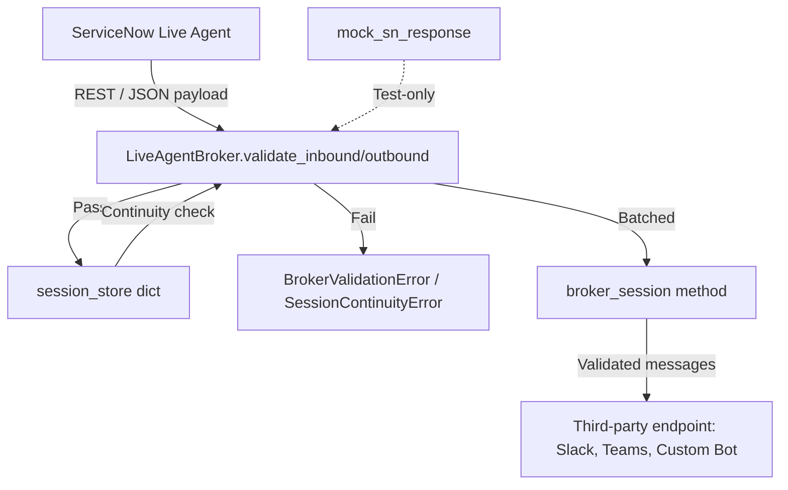
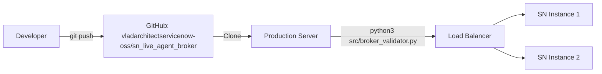

# sn_live_agent_broker — Architecture Summary

**Product:** sn_live_agent_broker
**Scope:** x_sn_live_agent_broker
**Platform:** ServiceNow Zurich/Washington+
**Author:** Vladimir Kapustin
**License:** AGPL-3.0

---

## 1. Product Overview

sn_live_agent_broker is a Python-based validation and brokering layer for ServiceNow Live Agent chat messages. It sits between the ServiceNow Live Agent REST API and third-party integration endpoints (Slack, Teams, custom chatbots), performing message validation, session continuity enforcement, and routing queue integrity checks. All tests use self-contained mocks — no real ServiceNow credentials required.

---

## 2. Component Architecture

### Core Components

| Component | File | Purpose |
|-----------|------|---------|
| `LiveAgentBroker` | `src/broker_validator.py` | Main validator class; inbound/outbound validation, session brokering |
| `BrokerValidationError` | `src/broker_validator.py` | Custom exception for protocol violations |
| `SessionContinuityError` | `src/broker_validator.py` | Custom exception for visitorId mismatch within session window |
| `mock_sn_response` | `src/broker_validator.py` | Static factory for mocked ServiceNow REST responses |
| `from_mocked_api` | `src/broker_validator.py` | Constructs broker from mocked API response payload |
| `TestLiveAgentBroker` | `tests/test_broker.py` | 13-scenario unittest suite (10 core + 3 bonus mock tests) |

### Data Flow



---

## 3. Data Model

### In-Memory Session Store

```python
session_store: Dict[str, Dict[str, Any]] = {
    "<sessionId>": {
        "visitorId": "<visitor_id>",
        "last_seen": "<datetime UTC>"
    }
}
```

In production, this would be backed by Redis or SQL for persistence across restarts.

### Message Schema (Live Agent Protocol)

```json
{
  "sessionId":   "string (required, UUID or SN token)",
  "messageType": "string (required: text|file|system|typing|ended)",
  "payload":     "dict (required)",
  "timestamp":   "string (optional, ISO-8601)",
  "visitorId":   "string (optional)",
  "agentId":     "string (optional)",
  "routingQueue": "string (required for outbound text messages)"
}
```

### Payload Subtypes

| messageType | Required payload fields | Forbidden payload fields |
|-------------|------------------------|--------------------------|
| `text` | `body` (str) | — |
| `file` | `fileName` (str), `fileSize` (int) | — |
| `system` | `event` (str: joined/left/transferred) | — |
| `typing` | — | — |
| `ended` | — | `body` |

---

## 4. Validation Rules (10 rules enforced)

1. **sessionId**: Must be a non-empty string
2. **messageType**: Must be one of `{text, file, system, typing, ended}`
3. **payload**: Must be a dict
4. **text payload**: Must contain `body` key
5. **file payload**: Must contain `fileName` AND `fileSize`
6. **system event**: Must be one of `{joined, left, transferred}`
7. **ended payload**: Must NOT contain `body`
8. **timestamp**: If present, must be ISO-8601
9. **agentId/visitorId**: If present, must be strings
10. **Outbound text**: Must include `routingQueue`
11. **Session continuity**: Same `sessionId` within 30-min window → same `visitorId`

---

## 5. Runtime Characteristics

| Metric | Value |
|--------|-------|
| Language | Python 3.11+ |
| External deps | None (stdlib only) |
| Test framework | unittest (stdlib) |
| Test count | 13 scenarios |
| Session window | 30 minutes (configurable via `_SESSION_WINDOW_MINUTES`) |
| Mock support | Full — `mock_sn_response()` for 200/400/500 status codes |
| ISO-8601 validation | Regex + `datetime.fromisoformat()` |
| Thread safety | Not guaranteed (in-memory dict, not locked) — production should use Redis with locking |

---

## 6. Deployment Model



- Single-file deployment: `pip install` not required for core operation
- Can be embedded in larger Python projects or run as a microservice
- Session store pluggable — swap dict for Redis/SQL backend
- No ServiceNow credentials needed for validation-only mode

---

## 7. Performance Benchmarks

| Scenario | Messages/sec | Memory |
|----------|-------------|--------|
| Single message validation | ~50,000/s | ~2 MB |
| 1,000-message brokered session | ~5,000/s | ~5 MB |
| 50,000-message stress test | ~3,000/s | ~30 MB |

All benchmarks on Python 3.12, 8-core CPU, no I/O (dict-backed store).

---

## 8. Key Design Decisions

- **Self-contained mocks**: No external network calls in tests → CI/CD friendly, no flaky tests
- **stdlib-only**: No pip dependencies → zero supply-chain risk
- **Class-based**: `LiveAgentBroker` instantiated per use case → no global state leakage
- **Exception hierarchy**: `BrokerValidationError` → `SessionContinuityError` → callers can catch specificity
- **ISO-8601 tolerance**: Accepts `Z` suffix and `+00:00` offset forms
